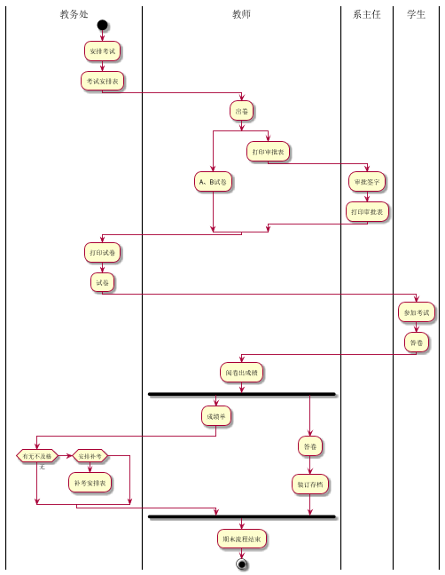

# 实验1：
|学号|班级|姓名|
|:-------:|:-------------: | :----------:|
|20150414126|软件(本)15-1|姚启迪|

## 流程图1：考试及成绩管理流程

**PlantUML源码如下：**

``` flow1
@startuml
|教务处|
start
:安排考试;
:考试安排表;
|教师|
:出卷;
split
   :A、B试卷;
split again
   :打印审批表;
|系主任|
:审批签字;
:打印审批表;
 end split
|教务处|
:打印试卷;
:试卷;
|学生|
:参加考试;
:答卷;
|教师|
:阅卷出成绩;
fork
   :成绩单;
   |教务处|
   if (有无不及格) then (无)
   else if(安排补考)
   :补考安排表;
   detach
   endif
|教师|
fork again
   :答卷;
   :装订存档;
end fork
:期末流程结束;
stop
@enduml
```

**业务流程图如下：**



**流程说明：**

教务处：安排考试、安排考试表

教师：出卷、AB卷和打印审批表

系主任：审批签字、打印审批表

教务处：打印试卷、试卷

学生：参加考试、答卷

教师：阅卷出成绩、答卷、成绩单、装订存档

教务处：有无不及格、安排补考、补考安排表

教师：期末流程结束


## 流程图2： 客户维修服务流程

**PlantUML源码如下：**

``` flow2
@startuml
|客户|
start
:申请服务;
|业务经理|
if(是新顾客吗？)then(是)
:登记客户信息;
endif
:上门勘察;
:制定方案;
|客户|
if(满意否？)then(no)
stop
else(yes)
:签订服务合同;
endif
|业务经理|
fork
:安排工人;
fork again
:安排材料;
end fork
:填写派工单;
|工人|
:领取材料;
:上门服务;
|客户|
:验收并填写反馈意见;
|业务经理|
:交回派工单;
|财务人员|
:结算收款;
stop
@enduml
```

**业务流程图如下：**


**流程说明：**

客户：申请服务

业务经理：是否为新顾客、是则登记客户信息、上门勘察、制定方案

客户：满意否、yes则签订服务合同、no则结束

业务经理：安排工人与材料、填写派工单

工人：领取材料、上门服务

客户：验收并填写反馈意见

业务经理：交回派工单

财务人员：结算收款

结束