# 实验2：图书管理系统用例建模
|学号|班级|姓名|
|:-------:|:-------------: | :----------:|
|201510414126|软件(本)15-1|姚启迪|

## 1. 图书管理系统的用例关系图

### 1.1 用例图PlantUML源码如下：

``` usecase
@startuml

left to right direction
:图书管理员: as admin
:借书者: as brow
brow-->(图书借阅管理)
(图书借阅管理)<|--(查询书目):<<extend>>
(图书借阅管理)<|--(借书):<<extend>>
(图书借阅管理)<|--(还书):<<extend>>
(图书借阅管理)<|--(预约):<<extend>>
(还书)<|.(罚款):<<extend>>
(借书).|>(查询书目):<<include>>
(预约).|>(查询书目):<<include>>
admin-->(借阅者管理)
admin-->(图书管理)
(借阅者管理)<|--(增加借书证):<<extend>>
(借阅者管理)<|--(删除借书证):<<extend>>
(借阅者管理)<|--(修改借书证):<<extend>>
(借阅者管理)<|--(查询借阅者):<<extend>>
(图书管理)<|--(查询书目):<<extend>>
(图书管理)<|--(增加图书):<<extend>>
(图书管理)<|--(删除图书):<<extend>>
(图书管理)<|--(修改图书):<<extend>>
@enduml
```


### 1.2. 用例图如下：


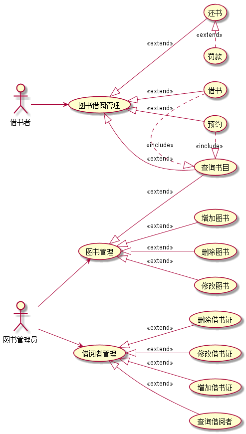

## 2. 参与者说明：

###     2.1 图书管理员

主要职责是：

图书管理（图书的增删查改）

借阅者管理（借阅者的增删查改）

###     2.2 读者

主要职责是：
图书借阅操作（借书、还书、预约、查找）


##     3. 用例规约表

###     3.1 “借书”用例

|用例名称|借书|
|:-----------------------:|:-----------------------:|
|参与者|借书者、管理员|
|前置条件|所借书目有余量|
|后置条件|成功借出|
|主事件流|
|参与者动作|系统行为|
|1.借书者借书申请并登陆<br>3.借书者输入登记信息|2.系统显示借阅登记<br>4.系统显示借书者借阅信息与可借时长与借阅权限；若登记信息非法进入4.11；若图书不存在进入4.21；若图书数量不足进入4.22|
|备选事件流|
|4.11登记信息不合法<br>4.21没有该书目<br>4.22书籍数量不足|4.11提示用户重新输入<br>4.21提示预购该书<br>4.22提示预约该书|


**“流程图源码：”**
``` uc1_flow
@startuml
|借书者|
start
:出示借书证;
|图书管理员|
if(是否可借)then(NO)
:无法借阅;
end
else
:可以借阅;
endif
:增加借书信息;
|借书者|
:图书借出;
stop
@enduml
```
**“流程图：”**
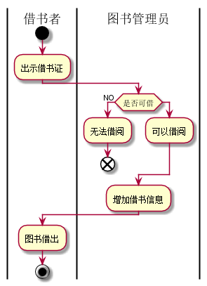

###     3.2 “还书”用例

|用例名称|还书|
|:-----------:|:-----------------------:|
|参与者|借阅者、管理员|
|前置条件|借阅过图书|
|后置条件|归还成功|
|主事件流|
|参与者动作|系统行为|
|1.借书者登录并申请还书<br>3.输入登记信息|2.显示还书窗口<br>4.显示在借图书信息与以借时间；若超时进去4.1|
|备选事件流|
|4.1节约超时|4.1提示先缴纳罚款后再还书|

**“流程图源码：”**
``` uc1_flow
@startuml
|借书者|
start
:图书归还;
|管理员|
:检查图书;
if(超时或者损坏)then(YES)
:缴纳罚款;
else
:增加积分;
endif
:记录信息;
|借书者|
:完成还书;
@enduml
```
**“流程图：”**
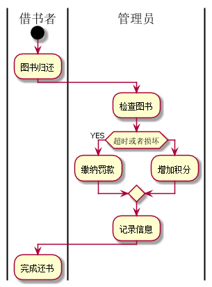

###     3.3 “预约”用例

|用例名称|预约图书|
|:-----------:|:-----------------------:|
|参与者|借阅者、管理员|
|前置条件|图书数量不足|
|后置条件|预约成功|
|主事件流|
|参与者动作|系统行为|
|1.借书者登录提交预约申请<br>3.借书者输入登记信息|2.显示预约窗口<br>4.显示预约图书信息|
|备选事件流|
|||

**“流程图源码：”**
``` uc1_flow
@startuml
|借书者|
start
:提出预约申请;
:出示借书证;
|管理员|
:检验是否可借;
if(可否借书)then(YES)
:添加预约信息;
else(NO)
end
endif
|借书者|
:预约成功;
@enduml
```
**“流程图：”**
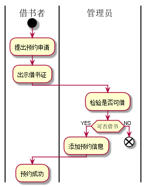

###     3.4 “增加图书”用例
|用例名称|增加图书|
|:-----------:|:-----------------------:|
|参与者|管理员|
|前置条件|登录管理系统|
|后置条件|添加成功|
|主事件流|
|参与者动作|系统行为|
|1.添加图书|2.显示添加图书信息|
|备选事件流|
|||

**“流程图源码：”**
``` uc1_flow
@startuml
|管理员|
start
:添加图书;
if(是否有该图书？)then(YES)
:数量+1;
else (NO)
:增加新书目;
endif
:添加成功;
@enduml
```
**“流程图：”**
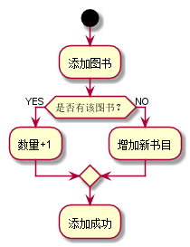

###     3.5 “删除图书”用例
|用例名称|删除图书|
|:-----------:|:-----------------------:|
|参与者|管理员|
|前置条件|登录至管理系统|
|后置条件|删除成功|
|主事件流|
|参与者动作|系统行为|
|1.删除图书|2.显示删除图书信息|
|备选事件流|
|||

**“流程图源码：”**
``` uc1_flow
@startuml
|管理员|
start
:删除图书;
if(是否有该图书)then(YES)
:删除书目;
else (NO)
end
endif
:删除成功;
@enduml
```
**“流程图：”**
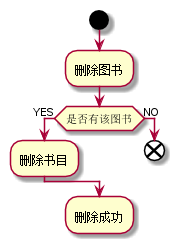

###     3.6 “查询图书”用例
|用例名称|查询图书|
|:-----------:|:-----------------------:|
|参与者|管理员|
|前置条件|登录至管理系统|
|后置条件|查询成功|
|主事件流|
|参与者动作|系统行为|
|1.查询图书|2.显示查询图书信息|
|备选事件流|
|||

**“流程图源码：”**
``` uc1_flow
@startuml
|借书者|
start
:查询书目申请;
|管理员|
:接受申请;
:查询书目;
|借书者|
:查询成功;
@enduml
```
**“流程图：”**
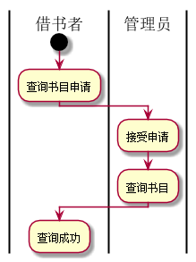

###     3.7 “修改图书”用例
|用例名称|修改图书|
|:-----------:|:-----------------------:|
|参与者|管理员|
|前置条件|登录至管理系统|
|后置条件|修改成功|
|主事件流|
|参与者动作|系统行为|
|1.修改图书|2.显示修改图书窗口|
|备选事件流|
|||

**“流程图源码：”**
``` uc1_flow
@startuml
|管理员|
start
:修改图书;
if(是否有该图书？)then(YES)
:修改书目信息;
else (NO)
end
endif
:修改成功;
@enduml
```
**“流程图：”**
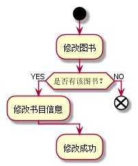

###     3.8 “增加借书证”用例
|用例名称|增加借书证|
|:-----------:|:-----------------------:|
|参与者|管理员|
|前置条件|登录至管理系统|
|后置条件|添加成功|
|主事件流|
|参与者动作|系统行为|
|1.添加借书证|2.显示添加信息窗口|
|备选事件流|
|||

**“流程图源码：”**
``` uc1_flow
@startuml
|管理员|
start
:增加借书证;
if(是否有该借书证？)then(YES)
end
else (NO)
:添加借书证信息;
endif
:增加借书证成功;
@enduml
```
**“流程图：”**
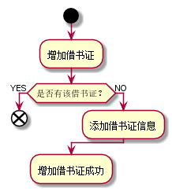

###     3.9 “删除借书证”用例
|用例名称|删除借书证|
|:-----------:|:-----------------------:|
|参与者|管理员|
|前置条件|登录至管理系统|
|后置条件|删除成功|
|主事件流|
|参与者动作|系统行为|
|1.删除借书证|2.显示删除信息窗口|
|备选事件流|
|||

**“流程图源码：”**
``` uc1_flow
@startuml
|管理员|
start
:删除借书证;
if(是否有该借书证？)then(YES)
:删除借书证信息;
else (NO)
end
endif
:删除成功;
@enduml
```
**“流程图：”**
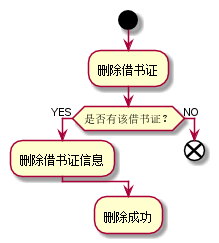

###     3.10 “查询借书证”用例
|用例名称|查询借书证|
|:-----------:|:-----------------------:|
|参与者|管理员|
|前置条件|登录至系统管理|
|后置条件|查询成功|
|主事件流|
|参与者动作|系统行为|
|1.查询借书证|2.显示借书证信息|
|备选事件流|
|||

**“流程图源码：”**
``` uc1_flow
@startuml
start
:查询借书证;
if(是否有该借书证？)then(YES)
:显示借书证信息;
else (NO)
end
endif
:查询成功;
@enduml
```
**“流程图：”**
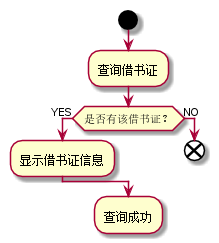

###     3.11 “修改借书证”用例
|用例名称|修改借书证|
|:-----------:|:-----------------------:|
|参与者|管理员|
|前置条件|登录至管理系统|
|后置条件|修改成功|
|主事件流|
|参与者动作|系统行为|
|1.修改借书证|2.显示修改窗口|
|备选事件流|
|||

**“流程图源码：”**
``` uc1_flow
@startuml
|管理员|
start
:修改借书证;
if(是否有该借书证？)then(YES)
:修改借书证信息;
else (NO)
end
endif
:修改成功;
@enduml
```
**“流程图：”**
