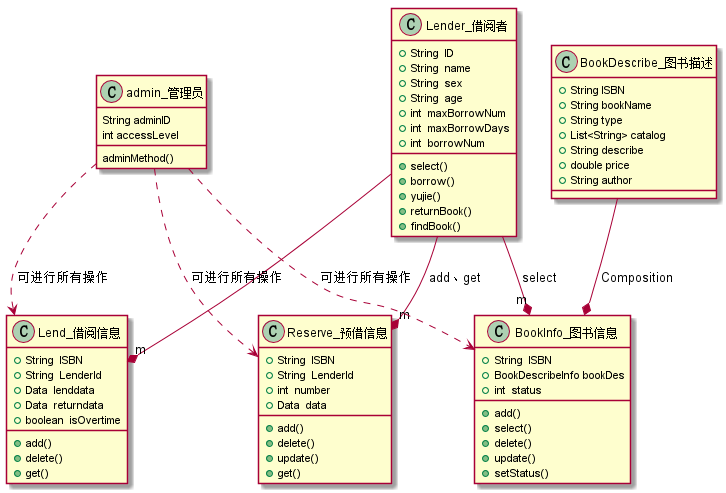
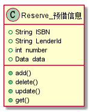
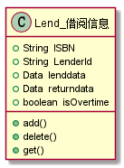
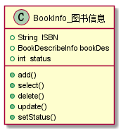
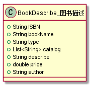
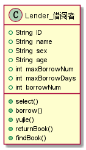
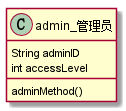

# 实验3：图书管理系统领域对象建模
|学号|班级|姓名|
|:-------:|:-------------: | :----------:|
|201510414126|软件15-1|姚启迪|

## 1. 图书管理系统的类图

### 1.1 类图PlantUML源码如下：

``` class
@startuml
class Reserve_预借信息{
    +String  ISBN
    +String  LenderId
    +int  number
    +Data  data
    +add()
    +delete()
    +update()
    +get()
}
class Lend_借阅信息{
    +String  ISBN
    +String  LenderId
    +Data  lenddata
    +Data  returndata
    +boolean  isOvertime
    +add()
    +delete()
    +get()
}
class BookInfo_图书信息{
    +String  ISBN
    +BookDescribeInfo bookDes
    +int  status
    +add()
    +select()
    +delete()
    +update()
    +setStatus()
}
class BookDescribe_图书描述{
    +String ISBN
    +String bookName
    +String type
    +List<String> catalog
    +String describe
    +double price
    +String author
}
class Lender_借阅者{
    +String  ID
    +String  name
    +String  sex
    +String  age
    +int  maxBorrowNum
    +int  maxBorrowDays
    +int  borrowNum
    +select()
    +borrow()
    +yujie()
    +returnBook()
    +findBook()
}
class admin_管理员{
    String adminID
    int accessLevel
    adminMethod()
}
BookDescribe_图书描述 --* BookInfo_图书信息:Composition
Lender_借阅者 --* "m"BookInfo_图书信息:select
Lender_借阅者 --* "m"Reserve_预借信息:add、get
Lender_借阅者 --* "m"Lend_借阅信息
admin_管理员 ..> BookInfo_图书信息:可进行所有操作
admin_管理员 ..> Reserve_预借信息:可进行所有操作
admin_管理员 ..> Lend_借阅信息:可进行所有操作

@enduml
```

### 1.2. 类图如下：




### 1.3. 类图说明：
图书描述为图书信息的一个部分

lender和admin均可以对图书信息类、预借信息类、借阅信息类进行操作

lender和admin操作权限大小不同


## 2. 图书管理系统的对象图
### 2.1 类Reserve_预借信息的对象图
#### 源码如下：
``` class
@startuml
class Reserve_预借信息{
    +String  ISBN
    +String  LenderId
    +int  number
    +Data  data
    +add()
    +delete()
    +update()
    +get()
}
@enduml
```
#### 对象图如下：


### 2.2 类Lend_借阅信息的对象图
#### 源码如下：
``` class
@startuml
class Lend_借阅信息{
    +String  ISBN
    +String  LenderId
    +Data  lenddata
    +Data  returndata
    +boolean  isOvertime
    +add()
    +delete()
    +get()
}
@enduml
```
#### 对象图如下：


### 2.3 类BookInfo_图书信息的对象图
#### 源码如下：
``` class
@startuml
class BookInfo_图书信息{
    +String  ISBN
    +BookDescribeInfo bookDes
    +int  status
    +add()
    +select()
    +delete()
    +update()
    +setStatus()
}
@enduml
```
#### 对象图如下：


### 2.4 类BookDescribe_图书描述的对象图
#### 源码如下：
``` class
@startuml
class BookDescribe_图书描述{
    +String ISBN
    +String bookName
    +String type
    +List<String> catalog
    +String describe
    +double price
    +String author
}
@enduml
```
#### 对象图如下：


### 2.5 类Lender_借阅者的对象图
#### 源码如下：
``` class
@startuml
class Lender_借阅者{
    +String  ID
    +String  name
    +String  sex
    +String  age
    +int  maxBorrowNum
    +int  maxBorrowDays
    +int  borrowNum
    +select()
    +borrow()
    +yujie()
    +returnBook()
    +findBook()
}

@enduml
```
#### 对象图如下：


### 2.6 类admin_管理员的对象图
#### 源码如下：
``` class
@startuml
class admin_管理员{
    String adminID
    int accessLevel
    adminMethod()
}
@enduml
```
#### 对象图如下：
