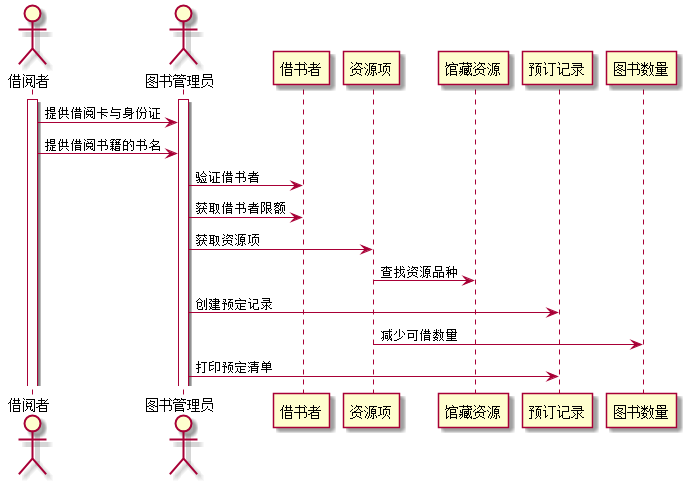
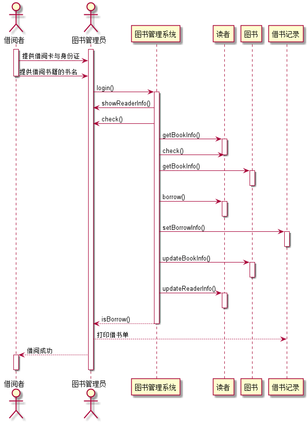
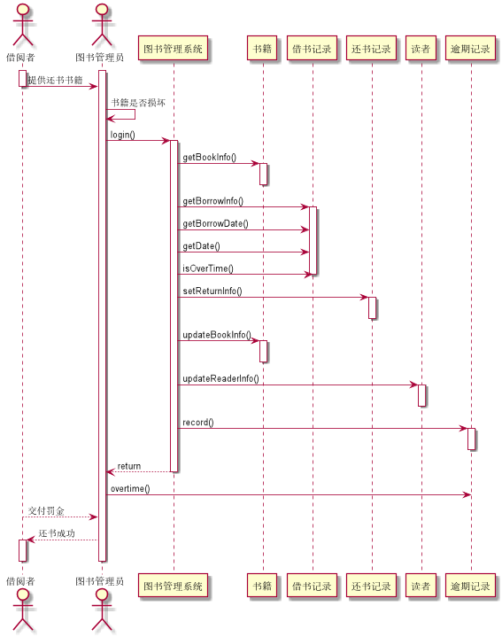

# 实验4：图书管理系统顺序图绘制
|学号|班级|姓名|
|:-------:|:-------------: | :----------:|
|201510414126|软件(本)15-1|姚启迪|

## 图书管理系统的顺序图

## 1. 预借用例
## 1.1. 预借用例PlantUML源码

``` sequence
@startuml
actor  借阅者 as reader
actor  图书管理员 as admin
activate reader
activate admin
reader->admin:提供借阅卡与身份证
reader->admin:提供借阅书籍的书名
admin->借书者:验证借书者
admin->借书者:获取借书者限额
admin->资源项:获取资源项
资源项->馆藏资源:查找资源品种
admin->预订记录:创建预定记录
资源项->图书数量:减少可借数量
admin->预订记录:打印预定清单
@enduml
```

## 1.2. 预借用例顺序图


## 1.3. 预借用例顺序图说明
验证借书者信息和可借量

图书管理员发起借书请求

减少请求图书资源的可借数量和可借额度

创建借书记录

***

## 2. 借书用例
   ## 2.1. 借书用例PlantUML源码

   ``` sequence
   @startuml
actor  借阅者 as reader
actor  图书管理员 as admin
activate reader
activate admin
reader->admin:提供借阅卡与身份证
reader->admin:提供借阅书籍的书名
deactivate reader
admin->图书管理系统:login()
activate 图书管理系统
admin<-图书管理系统:showReaderInfo()
admin<-图书管理系统:check()
图书管理系统->读者:getBookInfo()
activate 读者
图书管理系统->读者:check()
deactivate 读者
图书管理系统->图书:getBookInfo()
activate 图书
deactivate 图书
图书管理系统->读者:borrow()
activate 读者
deactivate 读者
图书管理系统->借书记录:setBorrowInfo()
activate 借书记录
deactivate 借书记录
图书管理系统->图书:updateBookInfo()
activate 图书
deactivate 图书
图书管理系统->读者:updateReaderInfo()
activate 读者
deactivate 读者
图书管理系统-->admin:isBorrow()
deactivate 图书管理系统
admin-->借书记录:打印借书单
admin-->reader:借阅成功
activate reader
deactivate reader
deactivate admin
   @enduml
   ```

## 2.2. 借书用例顺序图
   

## 2.3. 借书用例顺序图说明
login()：借阅者把需借图书和借书卡号提供给图书管理员，图书管理员登陆图书管理系统

showReaderInfo()：登录系统后通过借书卡号显示该借阅者的信息

check()：检查该借阅者的合法性

getReaderInfo()：获取读者的相关信息

check()：检查该读者的借书限额，是否超限

getBookInfo()：获取需借图书的相关信息

borrow()：借阅者的借书

setBookInfo()：创建借书记录

updateBookInfo()：更新图书信息的函数，标记该图书的状态为已借

updateReaderInfo()：更新读者的借书信息

isBorrow()：借阅成功


   ***

## 3. 还书用例
## 3.1. 还书用例PlantUML源码

   ``` sequence
   @startuml
   actor  借阅者 as reader
   actor  图书管理员 as admin
   activate reader
   activate admin
   reader->admin:   提供还书书籍
   deactivate reader
   admin->admin:书籍是否损坏
   admin->图书管理系统:login()
   activate 图书管理系统
   图书管理系统->书籍:getBookInfo()
   activate 书籍
   deactivate 书籍
   图书管理系统->借书记录:getBorrowInfo()
   activate 借书记录
   图书管理系统->借书记录:getBorrowDate()
   图书管理系统->借书记录:getDate()
   图书管理系统->借书记录:isOverTime()
   deactivate 借书记录
   图书管理系统->还书记录:setReturnInfo()
   activate 还书记录
   deactivate 还书记录
   图书管理系统->书籍:updateBookInfo()
   activate 书籍
   deactivate 书籍
   图书管理系统->读者:updateReaderInfo()
   activate 读者
   deactivate 读者
   图书管理系统->逾期记录:record()
   activate 逾期记录
   deactivate 逾期记录
   图书管理系统-->admin:return
   deactivate 图书管理系统
   admin->逾期记录:overtime()
   reader-->admin:交付罚金
   admin-->reader:还书成功
   activate reader
   deactivate reader
   deactivate admin
   @enduml

   ```

## 3.2. 还书用例顺序图
   

## 3.3. 还书用例顺序图说明
login()：借阅者提供还书书籍，管理员登陆该系统

getBookInfo()：扫描该书籍的书号，获取相关图书信息

getBorrowInfo()：获取借阅记录的信息

getBorrowDate()：获取借阅该书籍的日期

getDate()：获取当前时间的日期

isOverTime()：判断该借阅者的借书时间是否超时

setReturnInfo()：创建还书记录

updateBookInfo()：更新图书馆里的书籍信息的函数，标记该图书的状态为可借

updateReaderInfo()：更新读者的还书信息

record()：记录借阅者的逾期记录

overtime():借阅超时

return：返回还书成功

   ***