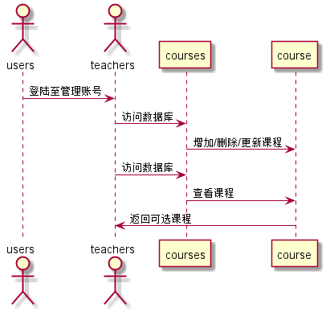

# “课程管理”用例 [返回](../README.md)
## 1. 用例规约

|用例名称|评定成绩|
|-------|:-------------|
|功能|管理员老师为平台挑选课程|
|参与者|老师|
|前置条件|老师先登录，进入课程管理页面|
|后置条件|老师为平台课程进行挑选|
|主事件流|1. 增加课程   2.删除课程   3. 更新课程选择表   |
|备选事件流||

## 2. 业务流程（顺序图）[源码](../src/课程管理.puml)
 

## 3. 界面设计
- 界面参照1: [课程管理界面-增](../ui/course_control_add.html)
- 界面参照2: [课程管理界面-删](../ui/course_control_delete.html)
- 界面参照3: [课程管理界面-查](../ui/course_control_check.html)
- API接口调用
    - 接口1：[add_course](../接口/add_course.md)   用于增加课程
    - 接口2：[delete_course](../接口/delete_course.md)   用于删除课程
    - 接口3：[check_course](../接口/check_course.md)   用于查看课程
    
## 4. 算法描述
   - 无
   
## 5. 参照表
   - [TEACHERS](../DesignDatabase.md/#TEACHERS)
   - [COURSES](../DesignDatabase.md/#COURSES)

